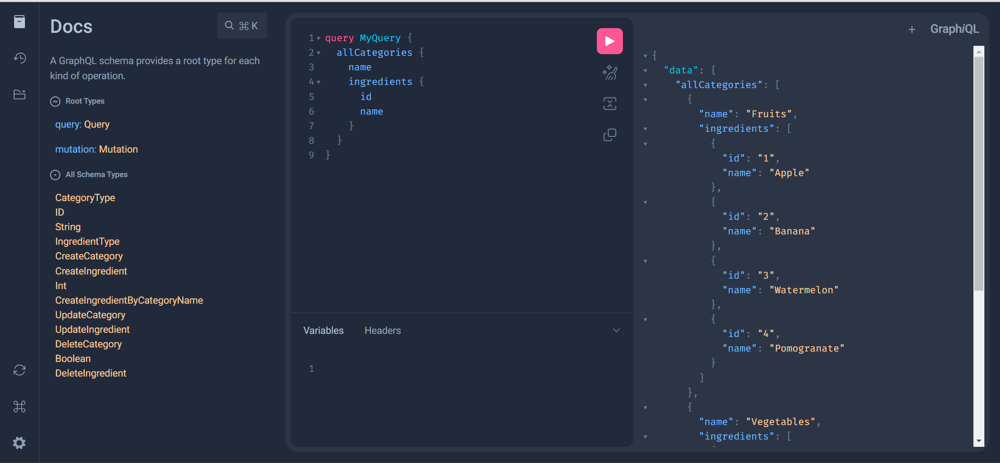

# GraphQL Django CRUD Example

This repository contains a sample Django project that demonstrates the implementation of a GraphQL API for performing CRUD (Create, Read, Update, Delete) operations on two models: Category and Ingredient. The project uses the Graphene-Django library to create the GraphQL API, providing a modern and efficient way to interact with the database.

## Features

- Create, read, update, and delete categories and ingredients using GraphQL queries and mutations.
- Use Django models to define the data schema and relationships.
- Utilize Django's ORM to handle database operations behind the scenes.
- Showcase proper structuring of a Django project and GraphQL API integration.
- Includes sample queries and mutations for easy testing and learning.

## Technologies Used

- Django
- Graphene-Django
- SQLite (or your preferred database)
- Python

## Usage

1. Clone the repository: `git clone https://github.com/ashishkushwaha22/Django-GraphQL.git`
2. Install project dependencies: `pip install -r requirements.txt`
3. Configure your database settings in `settings.py`.
4. Run migrations: `python manage.py migrate`
5. Start the development server: `python manage.py runserver`

You can access the GraphQL interface at `http://127.0.0.1:8000/graphql/` to interact with the API and perform CRUD operations on categories and ingredients.

## Contributions

Contributions and suggestions are welcome! Feel free to fork this repository, make improvements, and submit pull requests.

## License

This project is open-source and available under the MIT License.
